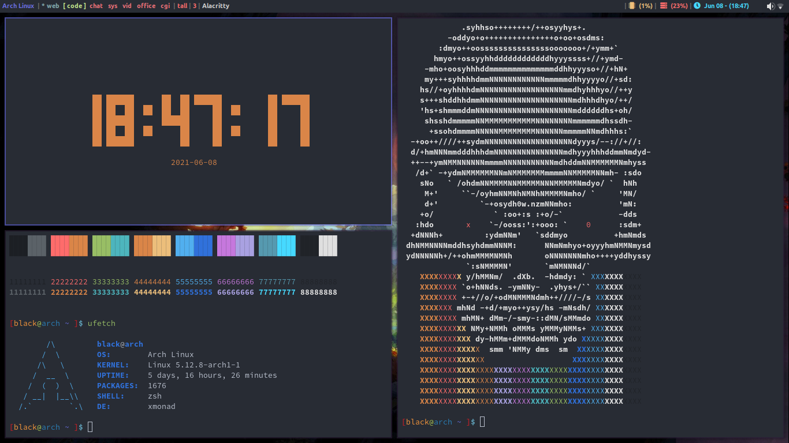
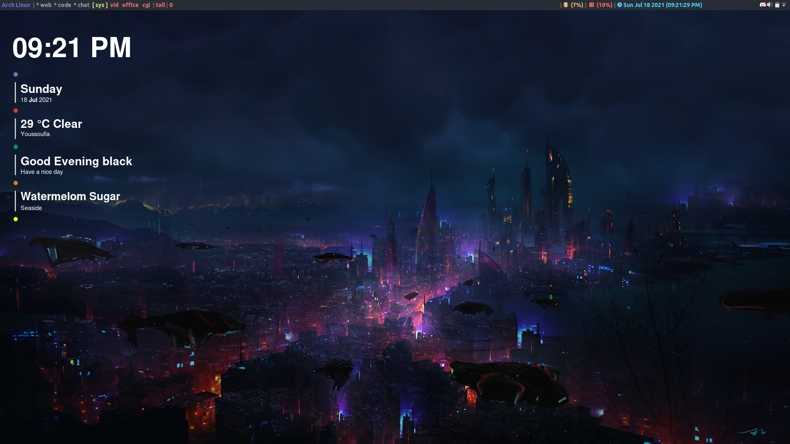
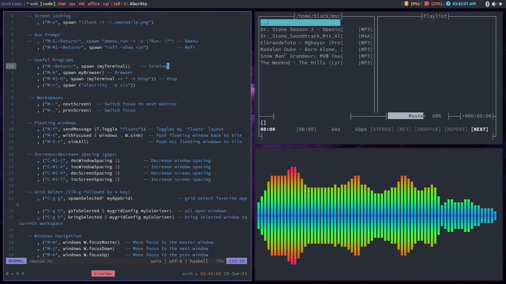

NOTE!!

Many of the config files in this repository are originally from Derek Taylor's Gitlab
Also known as DistroTube

These are the links to his work

[Derek Taylor on gitlab](https://gitlab.com/dwt1/)

[DistroTube channel on youtube](https://www.youtube.com/channel/UCVls1GmFKf6WlTraIb_IaJg)

For the xmonad installation guide, I took those steps from Brian Buccola

This is the original [article](https://brianbuccola.com/how-to-install-xmonad-and-xmobar-via-stack/)


I spent so much time looking for answers and trying to make things work in xmonad, so this is a guide to help you get the same outcome I got but whitout getting frustrated!!

Even thought I've done this on ```Arch``` some of the steps will stay the same on other ```Linux Distributions```

Enjoy the last result!!

Preview image
<br>

<br>

<br>

<br>

<br>

<br>

# My **Arch Linux Xmonad** setup

## Setup my environment

Install all my needed and favourites apps

* Terminal:
    * alacritty
    * kitty
* File explorer: ranger
    * Dependencies: w3m, uberzug
* Text editor: neovim
* IDE: visual-studio-code
* Shell: fish
* Browser: 
    * firefox
    * qutebrowser
* Video Editor:
    * kdenlive
    * openshot
* Screenshot utility: scrot
* ScreenLock utility: i3lock-fancy 
(or just ```i3lock``` with an image, it loads faster that way and you make it look the same as ```i3lock-fancy``` just check the [official repo](https://github.com/meskarune/i3lock-fancy) for more details on that)
* Music player: mocp (terminalbased)
* AudioVisualizer: cli-visualizer (terminal based)
* System ressources monitor: 
    * htop
    * gotop
* Fonts:
    * ttf-ubuntu-font-family
    * otf-fontawesome-5-free
    * ttf-open-sauce-sans
    * ttf-mononoki
    * adobe-source-code-pro-fonts
    * nerd-fonts-mononoki
    * ttf-arabeyes-fonts 
    * ttf-amiri
* Video player
    * mpv
    * vlc
* PDF reader: evince
* Office Suite:
    * WPS Office
    * LibreOffice
* Tools:
    * tmux
    * arch-wiki-docs
    * x-on-resize
    * blueman
    * xdg-user-dirs
    * git
    * paru
    * yay
    * python-pip
    * python2-pip
    * xclip
    * xsel
    * devour
    * shell-color-scripts
    * conky
    * doas
    * lsd
    * bat
    * jp2a
    * figlet
    * lolcat
    * neofetch
    * cowsay
    * tldr
    * tty-clock
    * pipes-rs
    * cmake
    * ninja
    * clang
    * pkgconf
    * base-devel
    * zsh-syntax-highlighting
    * zsh-autosuggestions-git
* LaTeX
    * texlive-most
    * texlive-lang
    * biber
* Xmonad utils
    * trayer
    * volumeicon
    * pavucontrol
    * pulseaudio
    * lxappearance
    * nitrogen
    * compton
    * dmenu
    * rofi
* Apps
    * telegram-desktop
    * discord
    * lightcord
    * blender
    * inkscape
    * gimp
    * krita
    * github-desktop
    * code
    * code-insiders
    * eclipse
    * atom
    * godot
* Programming Languages
    * dart/flutter
    * rust

<br>
To install the above packages follow the steps below
<br>

You might face some errors even if you're following the exact steps here.
If you do check the [ERRORS](./ERRORS.md) guide where I have solution to some common erros.


Clone this repo to your home direcotory using this command (IMPORTANT because all the commands in the steps will only work if you clone it in $HOME)

>```
>git clone https://github.com/black-purple/arch-xmonad-setup
>```

# Packages & Tools
To install the packages in the official repos use the following command:

>```
>sudo pacman -Syyu --needed openshot kitty arch-wiki-docs arch-wiki-lite pavucontrol pulseaudio lxappearance blueman tmux xsel xclip python-pip python2-pip ttf-ubuntu-font-family scrot curl wget base-devel cmake ninja pkgconf clang alacritty ranger w3m uberzug neovim fish firefox chromium qutebrowsr doas vlc mpv texlive-most texlive-lang biber xdg-user-dirs git xdotool lsd bat figlet lolcat neofetch cowsay tldr telegram-desktop discord libreoffice blender inkscape gimp krita atom godot evince rust
>```


To install packages from the aur use the following command:

NOTE!!

If you don't have an aur helper I suggest you use one.


I personally use paru so this is the command I'm using.

>```
>paru eclipse-java-bin lightcord i3lock-fancy-git gotop jp2a wps-office shell-color-scripts visual-studio-code-bin tty-clock visual-studio-code-insiders-bin pipes-rs github-desktop otf-fontawesome-5-free ttf-open-sauce-sans ttf-mononoki adobe-source-code-pro-fonts ttf-arabeyes-fonts ttf-amiri nerd-fonts-mononoki devour shell-color-scripts zsh-syntax-highlighting zsh-autosuggestions-git
>```

If you want to install paru use this chain of commands:

>```
>cd /tmp; git clone https://aur.archlinux.org/paru.git; cd paru; makepkg -si
>```
<br>

## User Dirs

Change the dir names for my user dirs (Desktop, Downloads, Pictures...) to shorter lowercase names (dt, dls, pcs...) for quick access in the terminal.

>```
>nvim ~/.config/user-dirs.dirs
>```

## Xmonad
Follow the steps here from Brian Buccula's [blog](https://brianbuccola.com/how-to-install-xmonad-and-xmobar-via-stack/) to install **Xmonad**, **Xmonad-contrib** and **Xmobar** using the stack method.

I chose this method to give you the choice to compile these packages with the flags you want.
<br>
<hr>

## Shell prompt
Install [starship prompt](https://starship.rs/) using their script

>```
>sh -c "$(curl -fsSL https://starship.rs/install.sh)"
>```

Add the appropriate line to your shell's config file

* bash
>```
># ~/.bashrc
>
>eval "$(starship init bash)"
>```

* fish
>```
># ~/.config/fish/config.fish
>
>starship init fish | source
>```

* zsh
>```
># ~/.zshrc
>
>eval "$(starship init zsh)"
>```

### Vim Plug

Run the following commad for Vim

>```
>curl -fLo ~/.vim/autoload/plug.vim --create-dirs \
>    https://raw.githubusercontent.com/junegunn/vim-plug/master/plug.vim
>```

Run the following command for Neovim

>```
>sh -c 'curl -fLo "${XDG_DATA_HOME:-$HOME/.local/share}"/nvim/site/autoload/plug.vim --create-dirs \
>       https://raw.githubusercontent.com/junegunn/vim-plug/master/plug.vim'
>```

These commads are taken from the [official repo](https://github.com/junegunn/vim-plug) of vim plug 


### Config Files

Clone the repo to your home directory
>```
>cd; git clone https://github.com/black-purple/arch-xmoand-setup
>```
Copy the config files each to it's appropriate location

* xmonad
>```
>rm ~/.xmonad/xmonad.hs
>cp ~/dotfiles/configs/xmonad.hs ~/.xmonad/xmonad.hs
>cp -r ~/dotfiles/xpm/ ~/.xmonad
>```

* xmobar
>```
>rm ~/.config/xmobar/xmobarrc
>cp ~/dotfiles/configs/xmobarrc ~/.config/xmobar/xmobarrc
>```

* rofi
>```
>rm -rf ~/.config/rofi
>cp -r ~/dotfiles/configs/rofi/ ~/.config/
>```

* neovim
>```
>rm ~/.config/nvim/init.vim
>cp ~/dotfiles/configs/init.vim ~/.config/nvim/init.vim
>```

After copying the config files run this command ```:PlugInstall```

If you face an issue with neovim plugins check the solution in [ERRORS.md](./ERRORS.md)


* vim
>```
>rm ~/.vimrc
>cp ~/dotfiles/configs/vimrc ~/.vimrc
>```

* alacritty
>```
>rm ~/.config/alacritty/alacritty.yml
>cp ~/dotfiles/configs/alacritty.yml ~/.config/alacritty/alacritty.yml
>```

* fish
>```
>rm -rf ~/.config/fish
>cp -r ~/dotfiles/configs/fish/ ~/.config/
>```

* ranger
>```
>rm -rf ~/.config/ranger
>cp -r ~/dotfiles/configs/ranger/ ~/.config/
>```

* conky
>```
>rm -rf ~/.config/conky/
>cp -r ~/dotfiles/configs/conky ~/.config/
>```


* tmux

You have to install Tmux Plugin Manager ([TPM](https://github.com/tmux-plugins/tpm)) in order for this config to work for you.

>```
>cp ~/dotfiles/configs/tmux.config ~/.tmux.config
>```

After copying this config file go inside of tmux and use this keyboard shortcut to install the basic tmux theme.

```Ctrl a + I (capital)```

You can find other themes on github [here](https://github.com/tmux-plugins).

## Conky Setup

I took the theming from [devianart](https://www.deviantart.com)
<br>
The creater is Khiky Merveilles
<br>
This is the [post](https://www.deviantart.com/khiky-merveilles/art/Enif-Conky-theme-880596072) on [devianart](https://www.deviantart.com)
<br>
Follow the inscructions there and copy the config files here to have the look in the screenshots

## Flutter Install

 Install flutter by cloning the official repo from github
>```
>git clone https://github.com/flutter/flutter.git
>```

Then add the flutter directory to you PATH

Run this command to see if flutter is working fine
(it might take some time to download some files)

>```
>flutter doctor
>```

You will have some erros concerning ```Android Studio``` and ```Android SDK```.

```Android Studio``` will install all the needed packages for android developpement including ```Android SDK```.

So to install ```Android Studio``` you have three options.

* #### From the AUR

Here I used paru, but you can use whatever AUR helper you feel confortable with
>```
>paru -S android-studio
>```

* #### Using SNAP package manager

Run this command to make sure that snap is installed. If it's not istalled it will install it for you.

>```
>sudo pacman -Sy --needed snapd
>```

To install ```Android Studio``` using snap, use this command

>```
>snap install android-studio --classic
>```

* #### Install from official website

Download the archive from [the official website](https://developer.android.com/studio/).

Go to ```~/Downloads``` and extract the archive.

```cd``` into ```~/Downloads/android-studio/```

Then open the file ```Install-Linux-tar.txt``` and follow the instructions there to install ```Android Studio```


Rerun this command to insure that everything is okay

>```
>flutter doctor -v
>```

If you face an error when trying to accept the ```android licenses``` consider checking [ERRORS.md](./ERRORS.md)

IMPORTANT!!

When done with all the errors you might want to run this command to download some needed packages for Flutter developpement (optional)

>```
>flutter precache
>```


If you want to enable desktop support in Flutter use this command

>``` 
>flutter config --enable-linux-desktop
>```

Run flutter doctor again to see if you need any other packages to make apps for Linux / Windows / Mac.

On ```Linux``` you'll need ```ninja, cmake, clang, pkg-config```

You can install them with this command

>```
>sudo pacman -S --needed ninja clang cmake pkgconf
>```

<br>
# Special Thanks 

* Derek Taylor
* Brian Buccola
* Khiky Merveilles
* Edoardo Vignati
